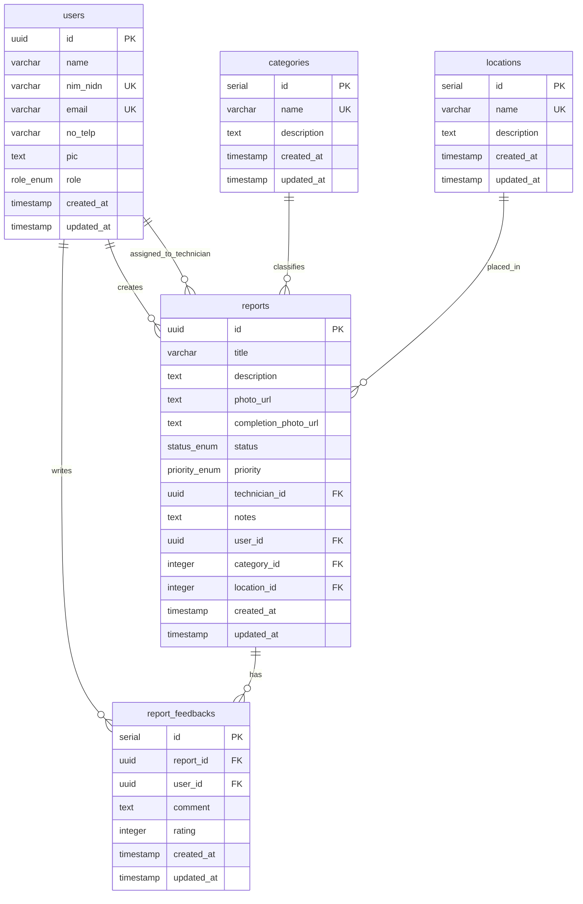

# 🏢 Silapor Backend REST API

[](https://nodejs.org/)
[](https://hono.dev/)
[](https://orm.drizzle.team/)
[-4169E1?style=for-the-badge&logo=postgresql)](https://neon.tech/)
[](https://www.typescriptlang.org/)

**Silapor** adalah Backend REST API untuk **Sistem Pelaporan dan Monitoring Kerusakan Fasilitas Kampus Berbasis Web**. Dibangun dengan performa tinggi menggunakan Hono.js, Drizzle ORM, dan database PostgreSQL (hosted di Neon DB).

---

## 🚀 Fitur Utama

- **Integrasi Campus Login API**: Autentikasi terintegrasi dengan API Kemahasiswaan UMM (`/api/auth/infokhs`) menggunakan NIM & Password SIM-Akademik.
- **Manajemen Pengguna & Role**: Hak akses bertingkat untuk **Mahasiswa**, **Dosen**, **Admin**, dan **Teknisi**.
- **Pelaporan Kerusakan**: Unggah bukti laporan kerusakan fasilitas kampus (berintegrasi dengan Cloudinary).
- **Penugasan Teknisi & Monitoring**: Admin dapat menugaskan teknisi dan memperbarui status laporan (`pending` ➔ `in_progress` ➔ `resolved` / `rejected`).
- **Feedback & Rating**: Pelapor dapat memberikan feedback rating (1-5) dan komentar pada laporan yang telah diselesaikan.
- **Dashboard Ringkasan**: Statistik laporan berdasarkan role user saat ini.
- **Dokumentasi Swagger Terintegrasi**: Dokumentasi interaktif OpenAPI langsung dari dashboard backend.

---

## 🛠️ Arsitektur Proyek & Struktur Folder

Patuhi arsitektur modular yang ketat berikut saat melakukan pengembangan:

```
├── api/                  # Entry point deployment (Vercel Serverless)
├── drizzle/              # Berkas migrasi database SQL (Auto-generated)
├── src/
│   ├── controllers/      # Mengatur alur Request & Response
│   ├── db/               # Inisialisasi DB, Drizzle Schema & Connection
│   ├── middleware/       # Autentikasi JWT dan pengecekan Role
│   ├── routes/           # Definisi Route & Endpoint API
│   ├── services/         # Logika bisnis utama & query Drizzle ORM
│   ├── utils/            # Utilitas umum & konfigurasi Swagger
│   ├── validators/       # Validasi skema input menggunakan Zod
│   ├── dev.ts            # Entry point untuk server development
│   └── index.ts          # Root routing & konfigurasi Hono App
├── drizzle.config.ts     # Konfigurasi Drizzle Kit
├── package.json          # Dependency & script project
└── tsconfig.json         # Konfigurasi compiler TypeScript
```

---

## 📂 Skema Database & Relasi

Berikut adalah visualisasi entitas database dan relasinya:



---

## 📜 Aturan & Standar Pengembangan (Development Rules)

> [!IMPORTANT]
> Semua developer yang berkontribusi dalam repository ini **WAJIB** mengikuti aturan penulisan kode berikut demi konsistensi dan skalabilitas kode:

### 1. Penamaan Variabel (Naming Convention)
- Gunakan bahasa Inggris yang jelas untuk nama fungsi, file, class, database table, dan variabel umum.
- **Pengecualian Preferensi User**: Diperbolehkan menggunakan nama variabel `angkasaya` sebagai counter/index looping, iterasi khusus, atau penampung nilai numerik spesifik.

### 2. Validasi Input & Keamanan
- Selalu validasi data request body, query params, atau route params menggunakan skema **Zod** melalui middleware `@hono/zod-validator`.
- Validasi wajib mencakup: format email, panjang minimal password, validasi format NIM/NIDN, dan validasi tipe file/foto sebelum diproses di controller.

### 3. Standardisasi Response JSON
Semua respon API harus mengembalikan format JSON yang konsisten dengan HTTP status code yang tepat:

- **Response Sukses (HTTP 200/201)**:
  ```json
  {
    "success": true,
    "message": "Pesan sukses dalam bahasa Indonesia/Inggris",
    "data": {} // objek data atau array []
  }
  ```
- **Response Gagal (HTTP 400/401/403/404/500)**:
  ```json
  {
    "success": false,
    "message": "Pesan kegagalan atau error validasi yang deskriptif",
    "error": {} // detail error teknis/validasi (opsional)
  }
  ```

### 4. Dokumentasi API (Swagger/OpenAPI)
- Selalu daftarkan atau perbarui spesifikasi OpenAPI di file [src/utils/swagger.ts](file:///Users/fithrichaerunisa/Nabil's%20Folder/Silapor/src/utils/swagger.ts) jika membuat endpoint baru atau mengubah request/response yang sudah ada.
- Pastikan parameter request, skema request body (JSON/Multipart), format response, dan skema keamanan JWT terdaftar dengan lengkap.

### 5. Alur Kerja Git Commit (Wajib)
Lakukan commit sesering mungkin setelah menyelesaikan satu sub-tahap fitur:
```bash
git add .
git commit -m "feat: deskripsi singkat perubahan dalam bahasa inggris"
git push origin main
```

---

## 📡 Daftar Endpoint API Utama

Berikut adalah rangkuman endpoint yang tersedia pada REST API Silapor:

### 🔐 Autentikasi (`/api/auth`)
| Metode | Endpoint | Deskripsi | Hak Akses |
| :--- | :--- | :--- | :--- |
| **POST** | `/api/auth/register` | Mendaftarkan pengguna lokal baru | Publik |
| **POST** | `/api/auth/login` | Login user lokal dengan email & password | Publik |
| **POST** | `/api/auth/infokhs` | Login mahasiswa via API Kampus (NIM & Password) | Publik |

### 👥 Manajemen User (`/api/users`)
| Metode | Endpoint | Deskripsi | Hak Akses |
| :--- | :--- | :--- | :--- |
| **GET** | `/api/users` | Mengambil daftar semua user | Admin |
| **GET** | `/api/users/:id` | Mengambil detail user berdasarkan ID | Admin |
| **POST** | `/api/users` | Menambahkan user baru secara manual | Admin |
| **PUT** | `/api/users/:id` | Memperbarui data user | Admin |
| **DELETE** | `/api/users/:id` | Menghapus user dari database | Admin |

### 🛠️ Laporan Kerusakan (`/api/reports`)
| Metode | Endpoint | Deskripsi | Hak Akses |
| :--- | :--- | :--- | :--- |
| **POST** | `/api/reports` | Membuat laporan baru (unggah gambar via Multipart) | Login |
| **GET** | `/api/reports` | Mengambil semua laporan (terfilter sesuai role) | Login |
| **GET** | `/api/reports/:id` | Mengambil detail laporan spesifik | Login |
| **PUT** | `/api/reports/:id/status` | Mengubah status laporan (`in_progress`, `resolved`, dll) | Admin / Teknisi |
| **PUT** | `/api/reports/:id/priority` | Menetapkan prioritas laporan (`rendah`, `sedang`, `tinggi`) | Admin |
| **PUT** | `/api/reports/:id/assign` | Menugaskan teknisi ke laporan | Admin |
| **PUT** | `/api/reports/:id/completion-photo` | Mengunggah bukti foto pengerjaan selesai | Teknisi |
| **POST** | `/api/reports/:id/feedbacks` | Memberikan feedback / rating pada laporan | Pelapor Laporan |

### 📊 Master Data & Dashboard
| Metode | Endpoint | Deskripsi | Hak Akses |
| :--- | :--- | :--- | :--- |
| **GET** | `/api/categories` | Mengambil semua kategori laporan | Login |
| **POST** | `/api/categories` | Membuat kategori laporan baru | Admin |
| **GET** | `/api/locations` | Mengambil semua lokasi fasilitas | Login |
| **POST** | `/api/locations` | Membuat lokasi fasilitas baru | Admin |
| **GET** | `/api/dashboard` | Statistik & summary laporan saat ini | Login |

---

## 🛠️ Instalasi & Menjalankan Proyek Secara Lokal

### Prerequisites
Pastikan Anda memiliki:
- **Node.js** v20+ atau **Bun** v1.0+
- Akun dan Database PostgreSQL di **Neon DB** (atau PostgreSQL lokal)
- Akun **Cloudinary** (untuk penyimpanan foto bukti laporan)

### Langkah Setup

1. **Clone Repository dan Masuk Direktori**
   ```bash
   git clone <repo-url>
   cd Silapor
   ```

2. **Instalasi Dependensi**
   ```bash
   npm install
   ```

3. **Konfigurasi Environment Variables**
   Salin berkas `.env.example` menjadi `.env` dan lengkapi nilainya:
   ```bash
   cp .env.example .env
   ```
   Isi berkas `.env` dengan kredensial Anda:
   ```env
   DATABASE_URL=postgresql://<user>:<password>@<neon-host>/neondb?sslmode=require
   JWT_SECRET=rahasia_jwt_anda
   CLOUDINARY_CLOUD_NAME=nama_cloud_anda
   CLOUDINARY_API_KEY=key_cloudinary_anda
   CLOUDINARY_API_SECRET=secret_cloudinary_anda
   CORS_ORIGIN=*
   ```

4. **Sinkronisasi Database (Drizzle Migrations)**
   Jalankan perintah ini untuk membuat tabel langsung di Neon DB sesuai dengan skema terbaru:
   ```bash
   npm run db:push
   ```

5. **Jalankan Aplikasi Mode Development**
   ```bash
   npm run dev
   ```
   Aplikasi akan berjalan di [http://localhost:3000](http://localhost:3000).

6. **Akses Dokumentasi Swagger**
   Buka browser dan arahkan ke [http://localhost:3000/swagger](http://localhost:3000/swagger) untuk melihat dan menguji REST API secara interaktif.

---

> [!TIP]
> Jika Anda ingin melihat perubahan data database secara visual di browser, jalankan `npm run db:studio` untuk membuka **Drizzle Studio** pada [http://localhost:15432](http://localhost:15432).
